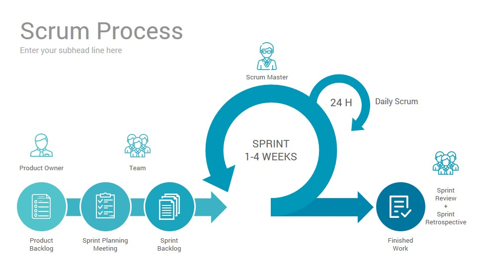

# Agile, SCRUM, and Kanban

## The Agile Manifesto
* Individuals and interactions over processes and tools
* Working software over comprehensive documentation
* Customer collaboration over contract negotiation
* Responding to change over following a plan

## SCRUM

### SCRUM Roles
* Development:
	* The people that do the work, developers, designers, writers etc.
	* Responsibilities:
		* Delivering the work through the sprint
		* Ensure transparency through the sprint at the daily standup
* Product owner:
	* Setting clear direction throughout the project
	* Responsibilities:
		* Manage the SCRUM backlog
		* Release management
		* Stakeholder management (work with all stakeholders to ensure development team is delivering value)
* SCRUM Master:
	* Glue everything together and ensuring that the SCRUM is being done well
	* Responsibilities:
		* Transparency (everyone can see what is going on)
		* Empiricism
		* Self-organisation
		* Values -
			- Courage
			- Focus
			- Commitment
			- Respect
			- Openness

### SCRUM Ceremonies

1. Sprint Backlog Refinement
	* Product owner and development team collaborate on the details within the backlog to refine, review and revise what is to be done
2. Sprint Planning Meeting
	* Breaks down items to do into tasks by asking:
		* What are we going to work on?
		* How are we going to do it?
3. Daily Stand-up Meeting
	* Daily SCRUM organised by the SCRUM master to synchronise the work of the team members
	* Ask:
		* What's done the prior day?
		* What needs to be done?
		* Any impediements?
4. Sprint Review Meeting
	* Held at end of each sprint, gives feedback to product owner and stakeholders, can rework backlog
5. Sprint Retrospective Meeeting
	* Reflection on previous sprint and to figure out how to improve as a team by asking:
		* What went well?
		* What did not?
		* What can be improved?

### SCRUM Artifacts
* Product Backlog
	* Master TO DO list of what needs to be done .e.g. features, requirements etc
* Sprint Backlog
	* List of items, user stories, bugs etc selected for the development team for implementation in the current sprint cycle
* Sprint Goal
	* End product from a sprint that works, meets definition of done

## User Stories

A user story is the smallest unit of work in an agile framework, though they can be used in other methodologies. It is often an end goal expressed from the software user's perspective.

They are an informal, general explanation of a software feature written from the perspective of the end user or customer.

### Benefits Of Creating User Stories

* **Keeps the focus on the user:**
	* Compared to a general to-do list, the stories keep the team focussed on solving problems for real users.
* **Enable collaboration:**
	* End goal defined, team can work together to determine how best to serve the user and meet that goal.
* **Drive creative solutions:**
	* Encourage critical and creative thinking about how best to solve towards an end goal.
* **Create momentum:**
	* Every story checked off, can enjoy a small win, thus driving momentum.

### User Story Contents
* Why are you building the project?
* What needs to be built?
* What value does it create?

### INVEST

The helps to remember a widely accepted set of criteria or checklist to assess to quality of a user story. This is:
* I - Independent (of all others)
* N - Negotiable (no specific contract for features)
* V - Valuable
* E - Estimatable (to a good approximation)
* S - Small (so can fit within an iteration)
* T - Testable (in theory, even if there is not available test yet)

### The 3 Amigos
The main perspectives used to examine an section of work before, during, and after development:
* Business
	* What problem are we trying to solve?
* Development
	 * How might we build a solution to solve that problem?
* Testing
	* What about this, what could possibly happen?

## Epic Stories

In short, an epic is a body of work that can be broken down into specific tasks (user stories) based upon the needs and requests of customers or end users. They can be a helpful way to organise work and create a hierarchy so that work can be broken down into shippable pieces so that large projects can get done on time and can continue to be shipped to customers on a regular basis.

**_Epics help teams break their work down, while continuing  to work towards a bigger goal._**

### Epic Contents
* Flexible scope
* Must be based upon customer feedback
* Continuous modification of user stories
* Effective teamwork and communication

# How Do User and Epic Stories Fit In With Agile and SCRUM?

Agile methodologies can implement user and epic stories to guide the and manage the scope and structure of work within an organisation. Given that user stories are short requirements written from the perspective of an end user, and epics are large bodies of work that break down into stories; these can be used to guide short-term sprints (as in SCRUM) and can enable the use of small, doable iterations within the agile process.

For example, an epic can be a sprint which is to 'update the UI the devices which view and use the website' with the user stories comprising of each task in the sprint .e.g. user A wants to access from a large iOS device. Epics themself in agile help the team understand how, why and what is required for the completion of a project which should reduce any potential issues for the team arising from miscommunication since it is all within the team.

# Kanban
Kanban is less 'structured' and all about limiting work in progress and maximising efficiency or flow. Focus on reducing time is takes to take a project (or user story) from start to finish. They do this by using a kanban board and continuously improving their flow of work. A kanban board basically has three stages of tasks that anyone can assign, **to do, in progress and done**.

See below for a table that compares kanban and SCRUM.

